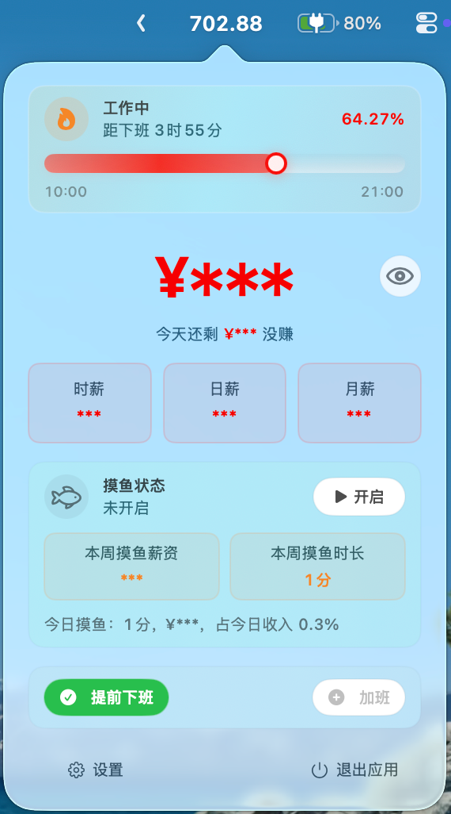
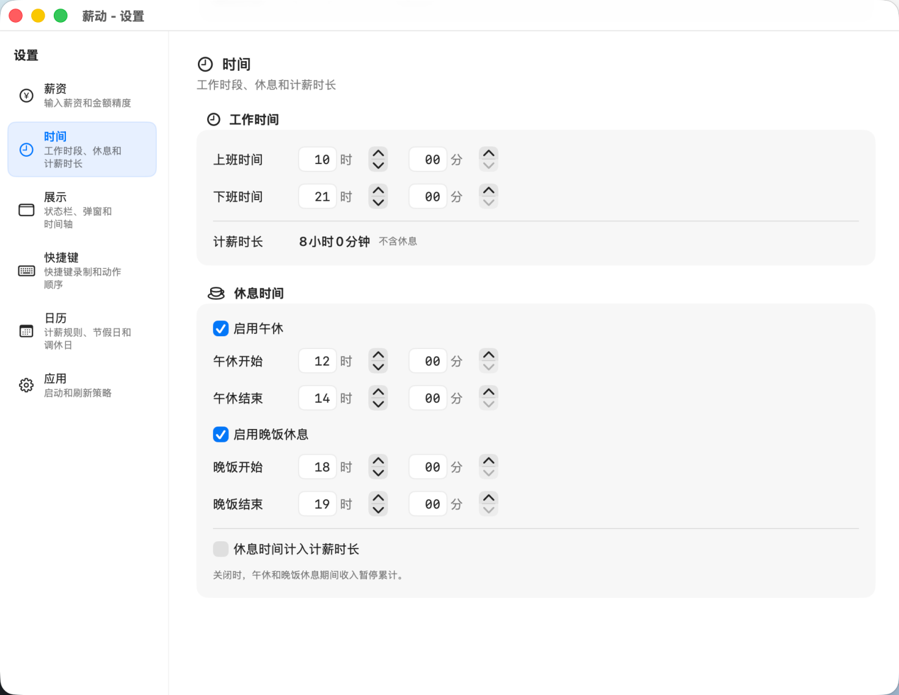
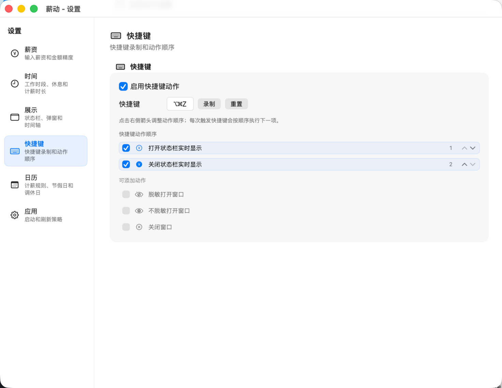
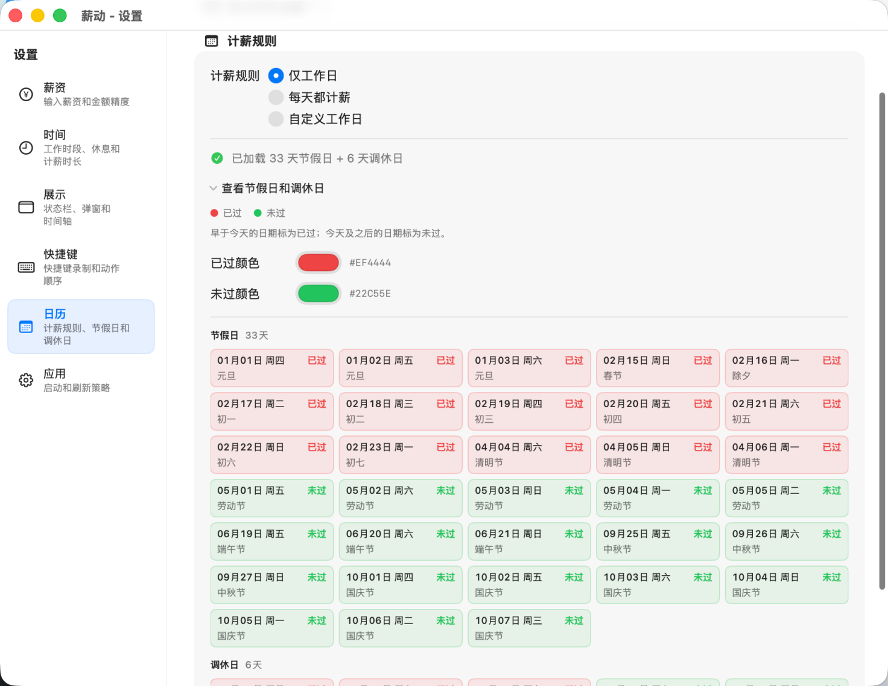

# 薪动 SalaryDance

薪动是一个 macOS 菜单栏 App，用实时薪资、工作进度、休息时间、快捷键和弹窗展示，把“今天赚了多少”变成一个随时间变化的桌面反馈。
全程通过vibe coding完成，人工仅少量修改文档。作者完全没学过mac开发。

## 下载

[下载最新版本](https://github.com/Elejiang/SalaryDance/releases)

## 快速预览
### 实时状态栏：


### 弹窗展示：


### 设置：







## 功能

- 状态栏实时薪资展示，支持数字滚动效果。
- 菜单栏弹窗展示今日收入、剩余未赚金额、秒薪、分薪、时薪、日薪、月薪、年薪。
- 工作进度时间轴，支持午休、晚饭、跨夜工作、晚班等场景。
- 薪资换算统一先折算为日薪，再派生其他周期薪资。
- 计薪规则支持仅工作日、节假日、调休日和自定义工作日。
- 全局快捷键支持动作序列，例如打开实时显示、关闭实时显示、打开脱敏弹窗、打开不脱敏弹窗、关闭弹窗。
- 代码完全开源，支持本地生成.dmg。

## 技术栈

| 类型 | 技术 |
|------|------|
| 语言 | Swift |
| UI | SwiftUI |
| macOS 桥接 | AppKit、Carbon HotKey |
| 配置存储 | UserDefaults + JSONEncoder / JSONDecoder |
| 构建 | Xcode project / xcodebuild |
| 打包 | shell + hdiutil |

## 本地开发/打包环境要求

- macOS
- Xcode
- Xcode Command Line Tools

确认 `xcodebuild` 可用：

```sh
xcodebuild -version
```

## 本地启动

推荐直接使用脚本启动：

```sh
scripts/dev_run.sh
```

脚本会执行三件事：

1. 构建 Debug 版本。
2. 关闭已运行的应用实例。
3. 打开最新构建出的 `SalaryDance.app`。

也可以手动构建：

```sh
xcodebuild \
  -project SalaryDance.xcodeproj \
  -scheme SalaryDance \
  -configuration Debug \
  -derivedDataPath /tmp/SalaryDanceDerivedData \
  build
```

## 打包 DMG

运行：

```sh
scripts/package_dmg.sh
```

产物会输出到 `dist/` 目录，文件名类似：

```text
dist/SalaryDance-1.0-1.dmg
```

打包流程面向个人分享，默认不是 Developer ID 签名和公证版本。首次打开时，macOS 可能提示无法验证开发者。

## 目录结构

```text
SalaryDance/
  Helpers/        节假日、快捷键、登录项等辅助能力
  Models/         配置模型、薪资计算、时间段规则
  ViewModels/     今日收入、进度、刷新定时器
  Views/          状态栏、弹窗、设置页等 UI

scripts/
  dev_run.sh      本地构建并启动
  package_dmg.sh  打包 DMG

docs/             项目规范和专题文档
SPEC.md           项目概览
AGENTS.md         AI 协作规范和提交规范
```
